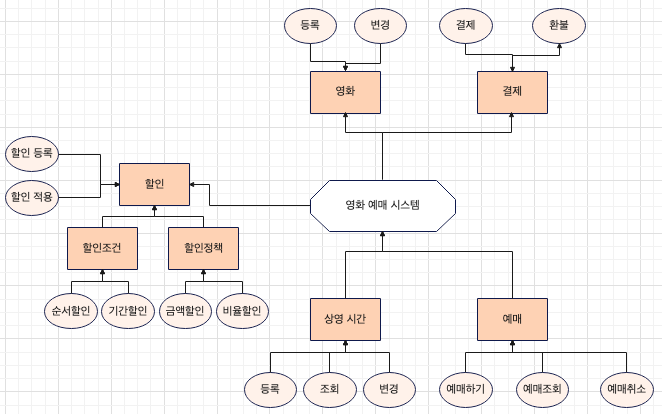

# 영화 예매 시스템 (용선)
## 1. 개요
### 1.1. 목적
- 도메인 주도 설계(Domain-Driven Design) 방법론을 이용한 영화 예매 시스템 구현
- 코드 품질을 향상 시키고 코드와 도메인 모델간에 간극을 줄여 유지보수성을 높이기 위함
- 구조화된 도메인 모델을 통해 향후 발생할 수 있는 도메인의 복잡성을 줄이고 유연성을 높이기 위함

## 2. 도메인 설계
### 2.1. 도메인 모델

### 2.2. 유비쿼터스 언어 정의
**영화(Movie)**
  - 등록: register
  - 변경: update
  - 영화 이름: movieName
  - 가격: price
  - 상영 시간: screenTime

**결제(Payment)**
- 결제: pay
- 환불: refund
- 결제 금액: paidAmount
- 환불 금액: refundedAmount
- 결제상태: paymentStatus
- 금융사: financialCompany
- 결제 날짜: paidAt
- 환불 날짜: refundedAt
  상영(Screen)
  등록: regist
  변경: update
  조회: 보류(특정 요구사항에 맞춰야 하기 때문에 보류)
  상영시작시간: startedAt
  상영종료시간: endedAt
  티켓수: tickets
  예매(Ticketing)
  예매하기: reserve
  예매취소: cancel
  예매일: reservedAt
  예매상태: TicketingStatus
  할인(Discout)
  등록: regist
  적용: apply
  할인 영화: movieId
  할인 조건: discountCodition
  할인 정책: discountPolicy
  할인 상태: discountStatus
  적용일: appliedAt
  할인된 금액: discountedAmount
  할인 조건(discountCodition)
  순서 조건: orderDiscountCondition
  날짜 조건: periodDiscountCondition
  순서값: orderConditionNumber
  순서날짜: orderConditionDate
  기간조건 시작날짜: discountConditionStartedAt
  기간조건 종료날짜: discountConditionEndedAt
  할인 아이디: discountId
  할인 정책(discountPolicy)
  금액할인: amountDiscount
  비율할인: percentDiscount
  할인금액: discountedAmount
  할인비율: discountedPercent
  할인아이디: discountId